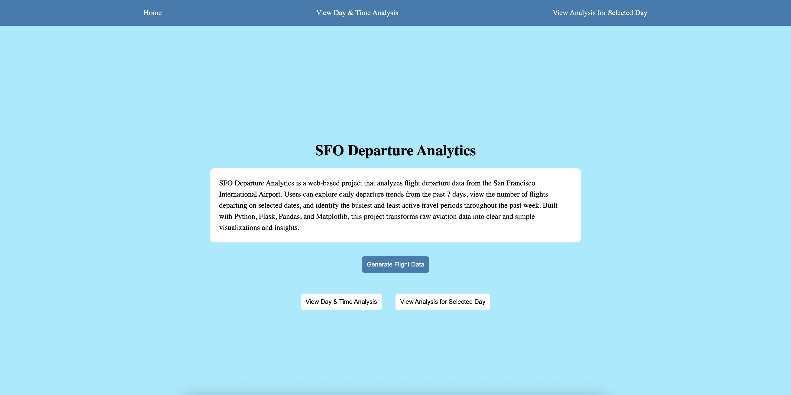
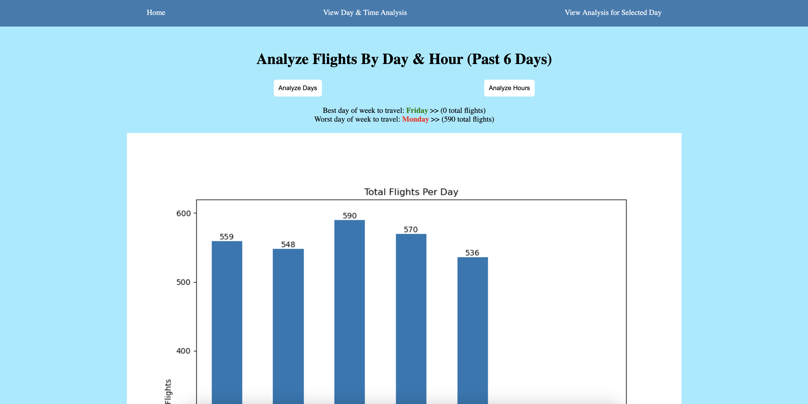
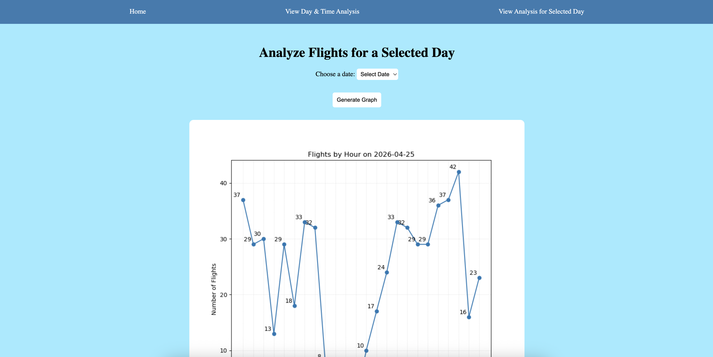

# CS-122-Final-Project

Project Title: SFO Flight Analytics

Authors: 
|           Name          |       GitHub Handle      |            Project Task             |
|-------------------------|--------------------------|-------------------------------------|
| Wendy Ta                | @wendyxta                | Data Collection Data Analysis    |
| Taanyaa Haridass Prasad | @taanyaaharidassprasad06 | Data Visualization Data Analysis |

Project Description:
We used the OpenSky Network API (https://openskynetwork.github.io/opensky-api/python.html#) to collect flight departure data from the San Francisco International Airport (SFO) for 7 days. Our project analyzes flight departures by day and hour to find busy and less busy travel time. This can help us understand flight patterns and choose better travel times.   

Project Outline/Plan:

- Interface Plan: We built a website using **Flask** where users can click buttons to view different graphs and analyzes to determine the most optimal time and day to travel. The website features four pages: a home page, a page for viewing retrieved data, a page for viewing day and time analysis, and a page where users can select a specific date to view hourly departure information for that day.

- Data Collection and Storage Plan:
  - Collection:
    - We used `get_departures_by_airport()` from the OpenSky API to collect flight departure data from the SFO Airport.
    - The API provides flight departure records which we processed to count the total number of flights per hour for each of the 7 days.
  - Storage Plan:
    - We parsed the data returned from the API and stored it in a CSV file for easier access and analysis.
    - The CSV file stores data such as the departure date, the hour of the departure, and the total number of flights departed from the SFO airport at that hour.
    - We then extracted the departure day and departure time from the CSV file and used it to generate graphs and perform flight trend analysis to display on our website.

- Data Visualization and Analysis Plan:
  - Visualization: 
    - Bar graphs to compare the total number of flights per day for a week
    - Bar graphs to display the number of flights departing during different hours of the day
    - Line graphs to show hourly departure trends for a user selected date to allow users to observe flight departure patterns throughout the day
  - Analysis:
    - We plan to use Python's libraries such as **Pandas** and **Matplotlib** to process, analyze, and visualize the flight data.
    - By analyzing the numerical data, we identified patterns and trends in SFO flight departures across different days and times. 
    - Using the graphs generated we determined the busiest day and busiest hour with the highest number of flights departing as well as the least busiest day and least busiest hour with least number of departures.
    - This analysis helps users better understand peak travel periods and identify more optimal times to fly from the SFO airport.
  
  
 

